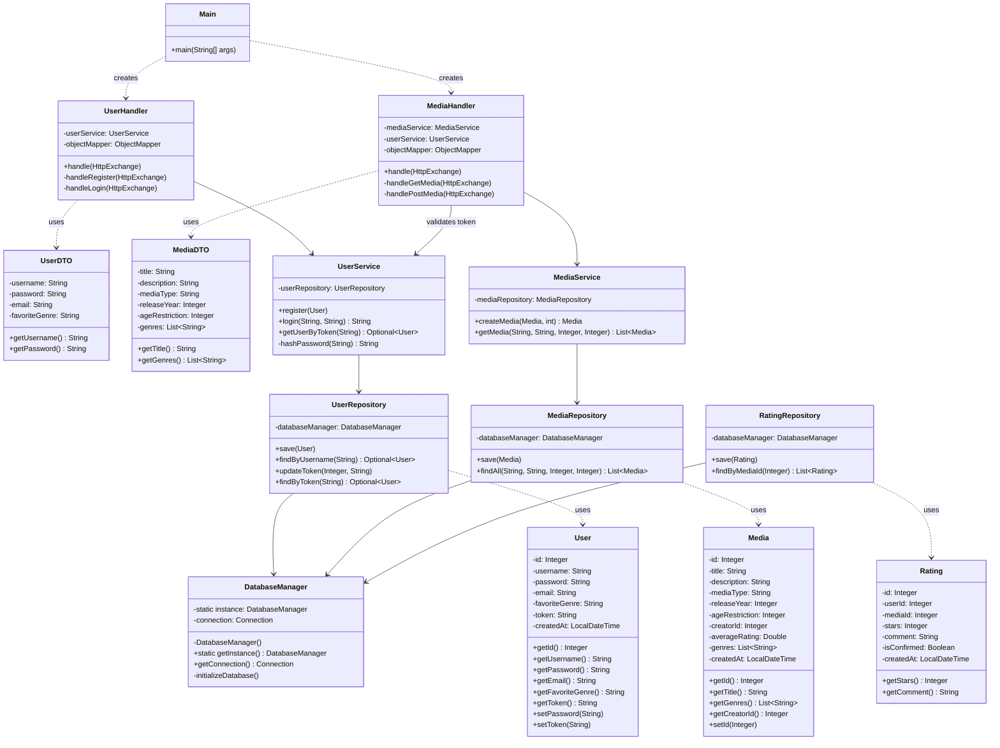

# MRP Class Diagram

```mermaid
classDiagram
    class Main {
        +main(String[] args)
    }

    class DatabaseManager {
        -static instance: DatabaseManager
        -connection: Connection
        -DatabaseManager()
        +static getInstance() DatabaseManager
        +getConnection() Connection
        -initializeDatabase()
    }

    %% Models
    class User {
        -id: Integer
        -username: String
        -password: String
        -email: String
        -favoriteGenre: String
        -token: String
        -createdAt: LocalDateTime
        +getId() Integer
        +getUsername() String
        +getPassword() String
        +getEmail() String
        +getFavoriteGenre() String
        +getToken() String
        +setPassword(String)
        +setToken(String)
    }

    class Media {
        -id: Integer
        -title: String
        -description: String
        -mediaType: String
        -releaseYear: Integer
        -ageRestriction: Integer
        -creatorId: Integer
        -averageRating: Double
        -genres: List~String~
        -createdAt: LocalDateTime
        +getId() Integer
        +getTitle() String
        +getGenres() List~String~
        +getCreatorId() Integer
        +setId(Integer)
    }

    class Rating {
        -id: Integer
        -userId: Integer
        -mediaId: Integer
        -stars: Integer
        -comment: String
        -isConfirmed: Boolean
        -createdAt: LocalDateTime
        +getStars() Integer
        +getComment() String
    }

    %% DTOs
    class UserDTO {
        -username: String
        -password: String
        -email: String
        -favoriteGenre: String
        +getUsername() String
        +getPassword() String
    }

    class MediaDTO {
        -title: String
        -description: String
        -mediaType: String
        -releaseYear: Integer
        -ageRestriction: Integer
        -genres: List~String~
        +getTitle() String
        +getGenres() List~String~
    }

    %% Repositories
    class UserRepository {
        -databaseManager: DatabaseManager
        +save(User)
        +findByUsername(String) Optional~User~
        +updateToken(Integer, String)
        +findByToken(String) Optional~User~
    }

    class MediaRepository {
        -databaseManager: DatabaseManager
        +save(Media)
        +findAll(String, String, Integer, Integer) List~Media~
    }

    class RatingRepository {
        -databaseManager: DatabaseManager
        +save(Rating)
        +findByMediaId(Integer) List~Rating~
    }

    %% Services
    class UserService {
        -userRepository: UserRepository
        +register(User)
        +login(String, String) String
        +getUserByToken(String) Optional~User~
        -hashPassword(String) String
    }

    class MediaService {
        -mediaRepository: MediaRepository
        +createMedia(Media, int) Media
        +getMedia(String, String, Integer, Integer) List~Media~
    }

    %% Handlers
    class UserHandler {
        -userService: UserService
        -objectMapper: ObjectMapper
        +handle(HttpExchange)
        -handleRegister(HttpExchange)
        -handleLogin(HttpExchange)
    }

    class MediaHandler {
        -mediaService: MediaService
        -userService: UserService
        -objectMapper: ObjectMapper
        +handle(HttpExchange)
        -handleGetMedia(HttpExchange)
        -handlePostMedia(HttpExchange)
    }

    %% Relationships
    Main ..> UserHandler : creates
    Main ..> MediaHandler : creates
    
    UserHandler --> UserService
    MediaHandler --> MediaService
    MediaHandler --> UserService : validates token
    
    UserService --> UserRepository
    MediaService --> MediaRepository
    
    UserRepository --> DatabaseManager
    MediaRepository --> DatabaseManager
    RatingRepository --> DatabaseManager
    
    UserRepository ..> User : uses
    MediaRepository ..> Media : uses
    RatingRepository ..> Rating : uses
    
    UserHandler ..> UserDTO : uses
    MediaHandler ..> MediaDTO : uses
```
