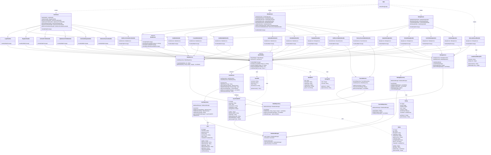

# MRP Class Diagram

```mermaid
classDiagram
    class Main {
        +main(String[] args)
    }

    class DatabaseManager {
        -static instance: DatabaseManager
        -connection: Connection
        -DatabaseManager()
        +static getInstance() DatabaseManager
        +getConnection() Connection
    }

    %% Models
    class User {
        -id: Integer
        -username: String
        -password: String
        -email: String
        -favoriteGenre: String
        -token: String
        -createdAt: LocalDateTime
        +getId() Integer
        +getUsername() String
        +getPassword() String
        +getEmail() String
        +getFavoriteGenre() String
        +getToken() String
        +setPassword(String)
        +setToken(String)
    }

    class Media {
        -id: Integer
        -title: String
        -description: String
        -mediaType: String
        -releaseYear: Integer
        -ageRestriction: Integer
        -creatorId: Integer
        -averageRating: Double
        -genres: List~String~
        -createdAt: LocalDateTime
        +getId() Integer
        +getTitle() String
        +getGenres() List~String~
        +getCreatorId() Integer
    }

    class Rating {
        -id: Integer
        -userId: Integer
        -mediaId: Integer
        -stars: Integer
        -comment: String
        -isConfirmed: Boolean
        -createdAt: LocalDateTime
        +getStars() Integer
        +getComment() String
    }

    %% DTOs
    class UserDTO {
        -username: String
        -password: String
        -email: String
        -favoriteGenre: String
        +getUsername() String
    }

    class UserProfileDTO {
        -id: Integer
        -username: String
        -email: String
        -favoriteGenre: String
        -totalRatings: Integer
        -averageScore: Double
        +getId() Integer
        +getUsername() String
        +getEmail() String
        +getFavoriteGenre() String
        +getTotalRatings() Integer
        +getAverageScore() Double
    }

    class MediaDTO {
        -title: String
        -description: String
        -mediaType: String
        -releaseYear: Integer
        -ageRestriction: Integer
        -genres: List~String~
    }

    class RatingDTO {
        -stars: Integer
        -comment: String
        +getStars() Integer
        +getComment() String
    }

    class LeaderboardEntryDTO {
        -username: String
        -ratingCount: Integer
        +getUsername() String
        +getRatingCount() Integer
    }

    %% Repositories
    class UserRepository {
        -databaseManager: DatabaseManager
        +save(User)
        +findByUsername(String) Optional~User~
        +findByToken(String) Optional~User~
        +updateToken(Integer, String)
        +getProfileWithStats(Integer) UserProfileDTO
        +update(User)
    }

    class MediaRepository {
        -databaseManager: DatabaseManager
        +save(Media)
        +findAll(String, String, Integer, Integer) List~Media~
        +findRecommendations(Integer) List~Media~
        +findById(Integer) Optional~Media~
    }

    class RatingRepository {
        -databaseManager: DatabaseManager
        +save(Rating)
        +findByMediaId(Integer) List~Rating~
        +findByUserId(Integer) List~Rating~
        +likeRating(Integer, Integer)
        +confirmRating(Integer)
    }

    class FavoriteRepository {
        -databaseManager: DatabaseManager
        +save(Integer, Integer)
        +delete(Integer, Integer)
        +findByUserId(Integer) List~Media~
    }

    %% Services
    class UserService {
        -userRepository: UserRepository
        -mediaRepository: MediaRepository
        +register(User)
        +login(String, String) String
        +getUserByToken(String) Optional~User~
        +updateProfile(Integer, String, String) User
        +getUserProfile(Integer) UserProfileDTO
        +getRecommendations(Integer) List~Media~
        -hashPassword(String) String
    }

    class MediaService {
        -mediaRepository: MediaRepository
        +createMedia(Media, int) Media
        +getMedia(String, String, Integer, Integer) List~Media~
    }

    class RatingService {
        -ratingRepository: RatingRepository
        -mediaRepository: MediaRepository
        +rateMedia(Rating)
        +confirmRating(Integer)
        +likeRating(Integer, Integer)
        +getUserRatings(Integer) List~Rating~
    }

    class FavoriteService {
        -favoriteRepository: FavoriteRepository
        -mediaRepository: MediaRepository
        +addFavorite(Integer, Integer)
        +removeFavorite(Integer, Integer)
        +getFavorites(Integer) List~Media~
    }

    %% Base Classes
    class BaseHandler {
        <<abstract>>
        #objectMapper: ObjectMapper
        #userService: UserService
        +handle(HttpExchange)
        #sendResponse(HttpExchange, int, String)
        #sendError(HttpExchange, int, String)
        #authenticate(HttpExchange) User
        #readBody(HttpExchange, Class) T
    }

    class BaseRouter {
        <<abstract>>
        +handle(HttpExchange)
        #sendResponse(HttpExchange, int, String)
        #sendNotFound(HttpExchange)
        #sendMethodNotAllowed(HttpExchange)
    }

    %% Routers
    class UserRouter {
        -loginHandler: LoginHandler
        -registerHandler: RegisterHandler
        -getUserProfileHandler: GetUserProfileHandler
        -updateUserProfileHandler: UpdateUserProfileHandler
        -getUserRatingsHandler: GetUserRatingsHandler
        -getUserFavoritesHandler: GetUserFavoritesHandler
        -getRecommendationsHandler: GetRecommendationsHandler
        +handle(HttpExchange)
    }

    class MediaRouter {
        -getMediaHandler: GetMediaHandler
        -createMediaHandler: CreateMediaHandler
        -getMediaByIdHandler: GetMediaByIdHandler
        -updateMediaHandler: UpdateMediaHandler
        -deleteMediaHandler: DeleteMediaHandler
        -rateMediaHandler: RateMediaHandler
        -addFavoriteMediaHandler: AddFavoriteMediaHandler
        -removeFavoriteMediaHandler: RemoveFavoriteMediaHandler
        +handle(HttpExchange)
    }

    class RatingRouter {
        -updateRatingHandler: UpdateRatingHandler
        -deleteRatingHandler: DeleteRatingHandler
        -confirmRatingHandler: ConfirmRatingHandler
        -likeRatingHandler: LikeRatingHandler
        +handle(HttpExchange)
    }

    %% Granular Handlers
    class LoginHandler {
        +handle(HttpExchange)
    }
    class RegisterHandler {
        +handle(HttpExchange)
    }
    class GetUserProfileHandler {
        +handle(HttpExchange)
    }
    class UpdateUserProfileHandler {
        +handle(HttpExchange)
    }
    class GetUserRatingsHandler {
        +handle(HttpExchange)
    }
    class GetUserFavoritesHandler {
        +handle(HttpExchange)
    }
    class GetRecommendationsHandler {
         -mediaService: MediaService
        +handle(HttpExchange)
    }

    class GetMediaHandler {
        -mediaService: MediaService
        +handle(HttpExchange)
    }
    class CreateMediaHandler {
        -mediaService: MediaService
        +handle(HttpExchange)
    }
    class GetMediaByIdHandler {
        -mediaService: MediaService
        +handle(HttpExchange)
    }
    class UpdateMediaHandler {
        -mediaService: MediaService
        +handle(HttpExchange)
    }
    class DeleteMediaHandler {
        -mediaService: MediaService
        +handle(HttpExchange)
    }
    class RateMediaHandler {
        -ratingService: RatingService
        +handle(HttpExchange)
    }
    class AddFavoriteMediaHandler {
        -favoriteService: FavoriteService
        +handle(HttpExchange)
    }
    class RemoveFavoriteMediaHandler {
        -favoriteService: FavoriteService
        +handle(HttpExchange)
    }

    class UpdateRatingHandler {
        -ratingService: RatingService
        +handle(HttpExchange)
    }
    class DeleteRatingHandler {
        -ratingService: RatingService
        +handle(HttpExchange)
    }
    class ConfirmRatingHandler {
        -ratingService: RatingService
        +handle(HttpExchange)
    }
    class LikeRatingHandler {
        -ratingService: RatingService
        +handle(HttpExchange)
    }
    class GetLeaderboardHandler {
        -ratingService: RatingService
        +handle(HttpExchange)
    }

    %% Inheritance
    UserRouter --|> BaseRouter
    MediaRouter --|> BaseRouter
    RatingRouter --|> BaseRouter

    LoginHandler --|> BaseHandler
    RegisterHandler --|> BaseHandler
    GetUserProfileHandler --|> BaseHandler
    UpdateUserProfileHandler --|> BaseHandler
    GetUserRatingsHandler --|> BaseHandler
    GetUserFavoritesHandler --|> BaseHandler
    GetRecommendationsHandler --|> BaseHandler

    GetMediaHandler --|> BaseHandler
    CreateMediaHandler --|> BaseHandler
    GetMediaByIdHandler --|> BaseHandler
    UpdateMediaHandler --|> BaseHandler
    DeleteMediaHandler --|> BaseHandler
    RateMediaHandler --|> BaseHandler
    AddFavoriteMediaHandler --|> BaseHandler
    RemoveFavoriteMediaHandler --|> BaseHandler

    UpdateRatingHandler --|> BaseHandler
    DeleteRatingHandler --|> BaseHandler
    ConfirmRatingHandler --|> BaseHandler
    LikeRatingHandler --|> BaseHandler
    GetLeaderboardHandler --|> BaseHandler

    %% Relationships
    Main ..> UserRouter : creates
    Main ..> MediaRouter : creates
    Main ..> RatingRouter : creates
    Main ..> GetLeaderboardHandler : creates

    UserRouter --> LoginHandler
    UserRouter --> RegisterHandler
    UserRouter --> GetUserProfileHandler
    UserRouter --> UpdateUserProfileHandler
    UserRouter --> GetUserRatingsHandler
    UserRouter --> GetUserFavoritesHandler
    UserRouter --> GetRecommendationsHandler

    MediaRouter --> GetMediaHandler
    MediaRouter --> CreateMediaHandler
    MediaRouter --> GetMediaByIdHandler
    MediaRouter --> UpdateMediaHandler
    MediaRouter --> DeleteMediaHandler
    MediaRouter --> RateMediaHandler
    MediaRouter --> AddFavoriteMediaHandler
    MediaRouter --> RemoveFavoriteMediaHandler

    RatingRouter --> UpdateRatingHandler
    RatingRouter --> DeleteRatingHandler
    RatingRouter --> ConfirmRatingHandler
    RatingRouter --> LikeRatingHandler

    %% Handler dependencies (Service injection usually in Main, passed to handlers)
    BaseHandler --> UserService : protected
    
    GetRecommendationsHandler --> MediaService
    
    GetMediaHandler --> MediaService
    CreateMediaHandler --> MediaService
    GetMediaByIdHandler --> MediaService
    UpdateMediaHandler --> MediaService
    DeleteMediaHandler --> MediaService
    
    RateMediaHandler --> RatingService
    
    AddFavoriteMediaHandler --> FavoriteService
    RemoveFavoriteMediaHandler --> FavoriteService
    
    UpdateRatingHandler --> RatingService
    DeleteRatingHandler --> RatingService
    ConfirmRatingHandler --> RatingService
    LikeRatingHandler --> RatingService
    GetLeaderboardHandler --> RatingService

    UserService --> UserRepository
    UserService --> MediaRepository
    
    MediaService --> MediaRepository
    
    RatingService --> RatingRepository
    RatingService --> MediaRepository

    FavoriteService --> FavoriteRepository
    FavoriteService --> MediaRepository
    
    %% Uses Relationships
    UserRepository --> DatabaseManager
    MediaRepository --> DatabaseManager
    RatingRepository --> DatabaseManager
    FavoriteRepository --> DatabaseManager
    
    UserRepository ..> User : uses
    MediaRepository ..> Media : uses
    RatingRepository ..> Rating : uses
    
    BaseHandler ..> UserDTO : uses
    BaseHandler ..> UserProfileDTO : uses
    BaseHandler ..> MediaDTO : uses
    BaseHandler ..> RatingDTO : uses
    GetLeaderboardHandler ..> LeaderboardEntryDTO : uses
    UserService ..> UserProfileDTO : produces
```