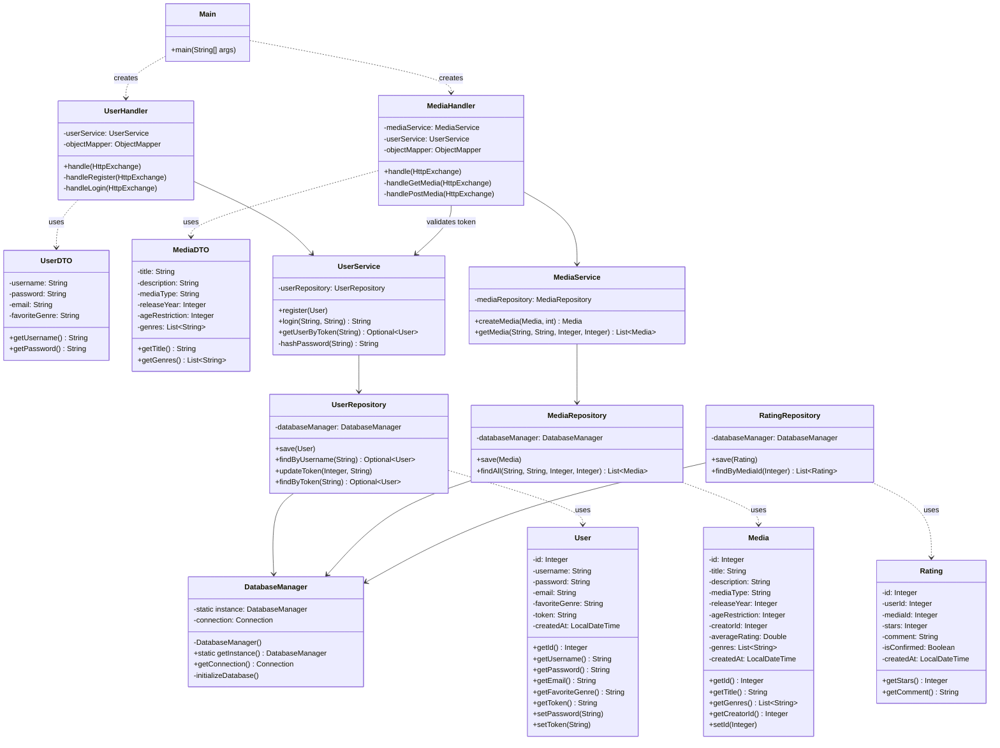

# Project Protocol: Media Ratings Platform (MRP)
**Author:** Peyman Aparviz

## 1. App Design

### Design Decisions
- **Architecture**: A **Layered Architecture** (`Handler` -> `Service` -> `Repository` -> `Database`) was chosen to enforce **Separation of Concerns** (SoC) and adhere to SOLID principles. This allows for easier testing and maintenance.
- **No Frameworks**: Adhering to strict project constraints, no heavy frameworks (like Spring Boot or Hibernate) were used.
    - **HTTP Server**: `com.sun.net.httpserver.HttpServer` is used for handling REST requests.
    - **Persistence**: **Pure JDBC** is used for database interactions to demonstrate understanding of low-level SQL handling.
- **Database & Security**:
    - **PostgreSQL**: Used as the relational database.
    - **SQL Injection Prevention**: All SQL queries use `PreparedStatement` to sanitise inputs.
    - **Singleton Pattern**: `DatabaseManager` is a singleton to manage a central database connection (simulating a simple connection pool/manager).
- **Data Transfer Objects (DTOs)**: `UserDTO` and `MediaDTO` are used to decouple the API layer (JSON structure) from the Model/Database layer. This prevents sensitive data (like password hashes) from accidentally leaking and allows the API schema to evolve independently of the DB schema.
- **Authentication**:
    - **Token-Based Auth**: Custom implementation using persistent tokens stored in the database.
    - **Format**: `mrp-token-<UUID>` (excluding PII like username from the token string for better security).
    - **Password Hashing**: SHA-256 is used for hashing passwords.
- **Builder Pattern**: Implemented in Models (`User`, `Media`, `Rating`) to handle complex object construction with many optional fields cleanly.

### Project Structure
The application is structured into the following packages:
- **`at.fhtw.swen1.mrp.data`**: Infrastructure layer handling database connections and creation.
- **`at.fhtw.swen1.mrp.dto`**: Plain Old Java Objects (POJOs) for JSON serialization/deserialization.
- **`at.fhtw.swen1.mrp.handler`**: The Controller layer. Responsible for parsing HTTP requests, validating input, calling services, and creating HTTP responses.
- **`at.fhtw.swen1.mrp.model`**: The Domain layer. Represents the core business entities.
- **`at.fhtw.swen1.mrp.repository`**: The Persistence layer. Contains all SQL logic and conversion from `ResultSet` to Models.
- **`at.fhtw.swen1.mrp.service`**: The Business Logic layer. Orchestrates business rules (e.g., verifying user existence before registration, hashing passwords).

## 2. Class Diagram

